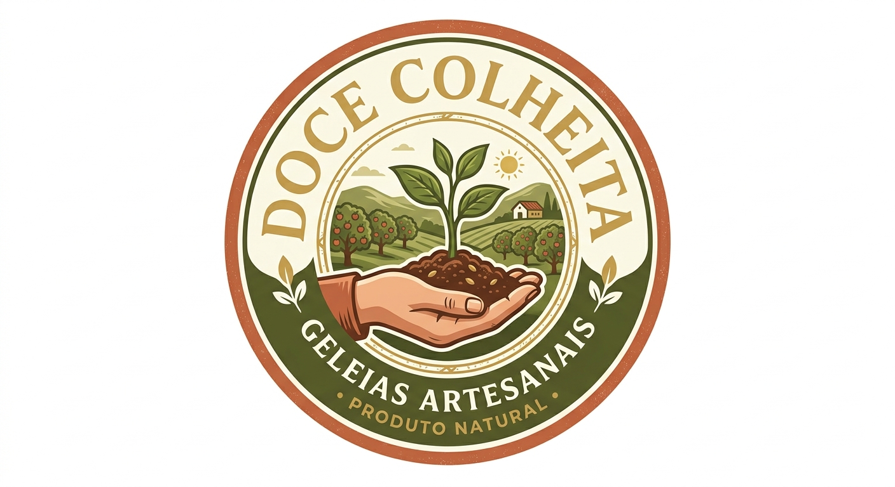
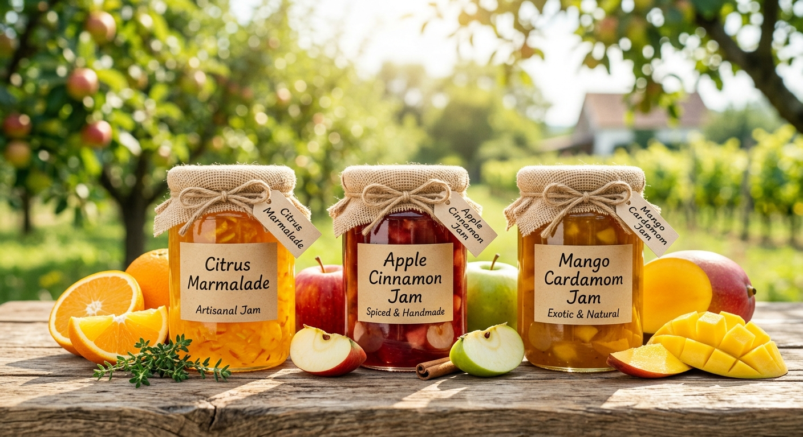

<p align="center">
  
</p>

<h1 align="center">Doce Colheita - Geleias Artesanais</h1>

<p align="center">
  Loja virtual responsiva para uma marca fictícia de geleias artesanais, com catálogo, carrinho, checkout simulado e uma experiência de IA para criação de sabores personalizados.
</p>

<p align="center">
  
  
  
  
</p>

## Sobre o projeto

O **Doce Colheita** é um projeto demonstrativo de e-commerce criado para apresentar uma experiência de compra elegante, artesanal e responsiva. A proposta é simular a presença digital de uma pequena marca gourmet, misturando visual acolhedor, catálogo de produtos, carrinho persistente e um recurso de IA para sugerir geleias personalizadas.

Este repositório foi pensado como peça de portfólio: ele mostra organização de componentes, consumo de API própria, uso de TypeScript, layout moderno e preocupação com experiência do usuário.

## Preview

<p align="center">
  
  
</p>

## Funcionalidades

- Catálogo de geleias e tortas artesanais.
- Cards de produto com informações visuais e comerciais.
- Carrinho de compras com persistência no `localStorage`.
- Modal de checkout com validação básica de dados.
- Geração de número de pedido simulado.
- Endpoint backend para finalizar pedidos.
- Sommelier de geleias com IA usando Gemini.
- Interface responsiva para desktop e mobile.
- Identidade visual voltada para uma marca rural, artesanal e gourmet.

## O que esse projeto demonstra

- Criação de interfaces modernas com **React** e **TypeScript**.
- Separação de responsabilidades entre componentes, dados e tipos.
- Construção de API com **Express**.
- Uso seguro de variável de ambiente para integração com IA.
- Fluxo completo de e-commerce demonstrativo.
- Escrita de um README apresentável para portfólio.
- Build de produção com **Vite** e empacotamento do servidor com **esbuild**.

## Tecnologias utilizadas

| Tecnologia | Uso no projeto |
| --- | --- |
| React | Construção da interface |
| TypeScript | Tipagem do front-end e backend |
| Vite | Ambiente de desenvolvimento e build |
| Express | Servidor e rotas da API |
| Tailwind CSS | Estilização da aplicação |
| Google GenAI SDK | Integração com Gemini para o sommelier de sabores |
| Lucide React | Ícones da interface |
| Motion | Animações e microinterações |

## Estrutura do projeto

```txt
.
├── src
│   ├── assets/images       # Imagens usadas na interface
│   ├── components          # Componentes reutilizáveis
│   ├── App.tsx             # Estrutura principal da aplicação
│   ├── data.ts             # Dados dos produtos
│   ├── index.css           # Estilos globais
│   ├── main.tsx            # Entrada do React
│   └── types.ts            # Tipos TypeScript
├── server.ts               # Servidor Express e endpoints da API
├── index.html
├── package.json
├── vite.config.ts
└── README.md
```

## Rotas da API

| Rota | Método | Descrição |
| --- | --- | --- |
| `/api/checkout` | `POST` | Simula o recebimento de um pedido e retorna um número de ordem |
| `/api/chef-sommelier` | `POST` | Usa IA para criar uma sugestão personalizada de geleia |

## Como rodar localmente

Antes de começar, tenha o **Node.js** instalado na máquina.

1. Clone o repositório:

   ```bash
   git clone https://github.com/elipey/doce-colheita-geleias-artesanais.git
   ```

2. Entre na pasta do projeto:

   ```bash
   cd doce-colheita-geleias-artesanais
   ```

3. Instale as dependências:

   ```bash
   npm install
   ```

4. Crie um arquivo `.env` baseado no `.env.example`:

   ```bash
   cp .env.example .env
   ```

5. Caso queira testar o sommelier com IA, preencha a variável:

   ```env
   GEMINI_API_KEY=sua_chave_aqui
   ```

6. Inicie o projeto:

   ```bash
   npm run dev
   ```

7. Acesse no navegador:

   ```txt
   http://localhost:3000
   ```

## Scripts disponíveis

| Comando | Descrição |
| --- | --- |
| `npm run dev` | Inicia o servidor de desenvolvimento |
| `npm run build` | Gera o build de produção |
| `npm start` | Executa o servidor em modo produção após o build |
| `npm run lint` | Verifica erros de TypeScript |

## Build de produção

```bash
npm run build
npm start
```

## Observações importantes

- O checkout é demonstrativo e não processa pagamentos reais.
- A integração com IA depende de uma chave `GEMINI_API_KEY`.
- O arquivo `.env` não deve ser enviado para o GitHub.
- O projeto representa uma marca fictícia, criada para fins de estudo e portfólio.

## Possíveis melhorias futuras

- Integração com gateway de pagamento real.
- Painel administrativo para gerenciar produtos.
- Banco de dados para pedidos e catálogo.
- Autenticação de usuários.
- Deploy público com URL de demonstração.
- Testes automatizados para componentes e API.

## Autor

Desenvolvido por [elipey](https://github.com/elipey) como projeto de portfólio.
